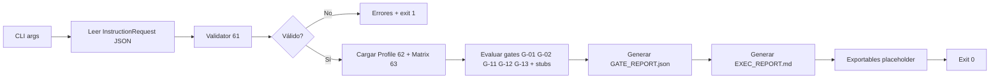

# Plan MVP CLI ia-exec-motor

## Prerrequisito: fuente de verdad

Los 4 documentos en [docs/ai-motor/](docs/ai-motor/) (60–63) son la fuente de verdad. **Antes de implementar el validador y los gates**, copia desde NotebookLM a este repo:

- `60_ARCHITECTURE_OVERVIEW.md`
- `61_PROMPT_INPUT_SCHEMA.md` → define **InstructionRequest**
- `62_QUALITY_PROFILE_SPEC.md` → Quality Profile
- `63_EXECUTION_POLICY_MATRIX.md` → Policy Matrix y gates (G-01, G-02, G-11, G-12, G-13, etc.)

Si no están aún, la Fase 1 puede usar placeholders en esos archivos y el código trabajará con un schema mínimo inferido (p. ej. `{ instruction, context?, options? }`) hasta reemplazarlos.

---

## Fase 1: Estructura del repo y placeholders

Crear exactamente esta estructura (archivos vacíos o con 1–2 líneas de placeholder):

```
ia-exec-motor/
  README.md
  AGENTS.md
  SPEC.md
  WORKFLOW.md
  docs/ai-motor/
    60_ARCHITECTURE_OVERVIEW.md
    61_PROMPT_INPUT_SCHEMA.md
    62_QUALITY_PROFILE_SPEC.md
    63_EXECUTION_POLICY_MATRIX.md
  context/
    README.md
  .cursor/rules/
    00_SYSTEM_CORE.mdc
    10_WORKFLOW_STRUCTURE.mdc
    30_QUALITY_GATES.mdc
  src/
  tests/
  package.json
```

- **README.md**: una línea tipo "CLI ia-exec-motor — valida InstructionRequest, aplica Quality Profile + Gates, genera reportes."
- **AGENTS.md**, **SPEC.md**, **WORKFLOW.md**: "TODO: ver SPEC / WORKFLOW."
- **docs/ai-motor/*.md**: si no los copias aún, poner "TODO: copiar desde NotebookLM."
- **context/README.md**: "Contexto del proyecto (placeholder)."
- **.cursor/rules/*.mdc**: placeholder por archivo (p. ej. "Reglas del motor — TODO").
- Dejar `src/` y `tests/` vacíos (solo con un `.gitkeep` si hace falta para que el árbol quede claro).

Comando útil tras crear carpetas: `touch` o crear cada archivo con contenido mínimo.

---

## Fase 2: Inicializar proyecto Node + TypeScript

- **package.json**: nombre `ia-exec-motor`, `type: "module"`, script `"cli": "node --experimental-strip-types src/cli.js"` o usar `tsx`/`ts-node` para ejecutar TS directo. Dependencias mínimas: sin frameworks; opcional `ajv` o `zod` para validación del schema.
- **TypeScript**: `tsconfig.json` con `"module": "NodeNext"`, `"target": "ES2022"`, salida en `dist/` o ejecutar con `tsx src/cli.ts`. Mantener configuración mínima.
- **Entrada del CLI**: un único punto de entrada, p. ej. `src/cli.ts`, que:
  - Acepte un path a un archivo InstructionRequest (JSON) por argumento.
  - En modo MVP no hace falta `--profile`; el Quality Profile y la Policy Matrix pueden ser config interna (const/JSON en `src/config/`).

Estructura de `src/` sugerida:

- `src/cli.ts` — parseo de args, orquestación.
- `src/validator.ts` — validación InstructionRequest (schema 61).
- `src/config/quality-profile.ts` o `.json` — Quality Profile (62).
- `src/config/policy-matrix.ts` o `.json` — Policy Matrix (63).
- `src/gates/` — evaluadores por gate: `g-01.ts`, `g-02.ts`, `g-11.ts`, `g-12.ts`, `g-13.ts` + `index.ts` que exporte todos y marque "not_implemented" el resto.
- `src/reporter.ts` — genera `GATE_REPORT.json` y `EXEC_REPORT.md`.
- `src/exportables.ts` — escribe `.cursor/rules/00_SYSTEM_CORE.mdc` y `AGENTS.md` (placeholders).

---

## Fase 3: Schema InstructionRequest (61) y validador

- Tras tener (o placeholder de) [docs/ai-motor/61_PROMPT_INPUT_SCHEMA.md](docs/ai-motor/61_PROMPT_INPUT_SCHEMA.md), definir en código el tipo **InstructionRequest** (interfaz TS o JSON Schema).
- **Parser/validator**: en `src/validator.ts`, función que reciba el path al JSON (o el objeto ya leído), valide contra el schema y devuelva `{ valid: boolean, errors?: string[] }`. Salidas deterministas.
- Si usas JSON Schema: un archivo `src/schemas/instruction-request.json` y validación con `ajv`. Si prefieres solo TypeScript: `zod` o validación manual según campos requeridos/opcionales del 61.

---

## Fase 4: Quality Profile (62) y Policy Matrix (63)

- Cargar **Quality Profile** y **Policy Matrix** como config interna (no desde UI): archivos en `src/config/` en formato JSON o constantes TS exportadas.
- El Quality Profile debe poder indicar "strict" vs "non-strict" (o equivalente) para los gates.
- La Policy Matrix define qué gates existen (G-01, G-02, G-11, G-12, G-13, …) y su severidad/threshold; el evaluador usará esto para decidir pass/fail y qué incluir en el reporte.

---

## Fase 5: Evaluador de gates

- **Implementados (lógica mínima)**:
  - **G-01, G-02, G-11, G-12, G-13**: según definición en 63. Si 63 no está, definir comportamiento mínimo (p. ej. G-01 = "instruction presente y no vacía", G-02 = "longitud mínima", etc.) y documentar en código como TODO alinear con 63.
- **Resto de gates**: stub que devuelva `{ id: "G-xx", status: "not_implemented", message: "..." }`.
- Entrada del evaluador: InstructionRequest validado + Quality Profile + Policy Matrix. Salida: lista de resultados por gate (id, status, message, detalles opcionales). Todo determinista.

---

## Fase 6: Generador de reportes

- **GATE_REPORT.json**: estructura fija que incluya timestamp (o versión), perfil usado, lista de resultados de gates (id, status, message, …). Formato estable para snapshot tests.
- **EXEC_REPORT.md**: plantilla en Markdown (título, resumen de gates, tabla o lista de resultados, sección "Logs del proceso"). Sin lógica de "runtime app" en logs; solo lo que el pipeline decidió y escribió en el reporte.

Ruta de salida: por defecto directorio actual o `--out-dir` si se añade luego; MVP puede fijar `./GATE_REPORT.json` y `./EXEC_REPORT.md`.

---

## Fase 7: Exportables mínimos

- **.cursor/rules/00_SYSTEM_CORE.mdc**: generado por el CLI (o escrito una vez) con contenido placeholder hasta que se defina el contenido real.
- **AGENTS.md**: igual, placeholder generado o estático.

El CLI debe poder invocar una función que escriba estos dos archivos con contenido mínimo (p. ej. "Placeholder — ia-exec-motor MVP").

---

## Fase 8: Tests y no-regresión

- **Tests de schema**:
  - Caso válido: InstructionRequest que cumpla 61 → validator acepta.
  - Casos inválidos: falta campo requerido, tipo incorrecto → validator rechaza con errores claros.
- **Tests de gate evaluation**:
  - Al menos un caso strict y un caso non-strict; verificar que los gates implementados devuelven el status esperado (pass/fail/not_implemented).
- **Snapshot de GATE_REPORT.json**:
  - Para un InstructionRequest fijo y perfil fijo, generar GATE_REPORT.json y comparar con snapshot guardado (Jest `toMatchSnapshot` o similar, o diff en test).
- Runner: Jest o Node test runner nativo; ejecución con `npm test`. Criterio: **no-regresión** — todo cambio debe mantener tests previos pasando.

---

## Orden de implementación sugerido

1. Estructura de carpetas y placeholders (Fase 1).
2. package.json + tsconfig + `src/cli.ts` mínimo (Fase 2).
3. Schema 61 (placeholders en docs si faltan) + validator + tests de schema (Fase 3 + parte Fase 8).
4. Config Quality Profile y Policy Matrix (Fase 4).
5. Gates G-01, G-02, G-11, G-12, G-13 + stubs + tests de gates (Fase 5 + Fase 8).
6. Reporter GATE_REPORT.json + EXEC_REPORT.md + test snapshot (Fase 6 + Fase 8).
7. Exportables 00_SYSTEM_CORE.mdc y AGENTS.md (Fase 7).

---

## Verificación

### Cómo ejecutar tests

- `npm install` (primera vez).
- `npm test` — ejecuta todos los tests (schema, gates, snapshot).
- Opcional: `npm run cli -- path/to/instruction-request.json` para prueba manual.

### Qué evidencia adjuntar en QA report

- Salida de `npm test` (todo en verde).
- `git diff --stat` tras la implementación (listado de archivos tocados).
- Ejemplo de `GATE_REPORT.json` y `EXEC_REPORT.md` generados para un InstructionRequest de ejemplo.
- Confirmación de que no hay UI y que las salidas son deterministas (mismo input → mismo reporte).

---

## Diagrama de flujo del CLI (MVP)




---

## Resumen de archivos a crear/modificar


| Área    | Archivos                                                                                                                                                                             |
| ------- | ------------------------------------------------------------------------------------------------------------------------------------------------------------------------------------ |
| Raíz    | README.md, AGENTS.md, SPEC.md, WORKFLOW.md, package.json, tsconfig.json                                                                                                              |
| Docs    | docs/ai-motor/60–63 (copiar o placeholder)                                                                                                                                           |
| Context | context/README.md                                                                                                                                                                    |
| Rules   | .cursor/rules/00_SYSTEM_CORE.mdc, 10_WORKFLOW_STRUCTURE.mdc, 30_QUALITY_GATES.mdc                                                                                                    |
| Source  | src/cli.ts, src/validator.ts, src/schemas/instruction-request (json o ts), src/config/quality-profile, src/config/policy-matrix, src/gates/*.ts, src/reporter.ts, src/exportables.ts |
| Tests   | tests/validator.test.ts, tests/gates.test.ts, tests/reporter.test.ts (o snapshot), fixtures/instruction-request-valid.json, fixtures/instruction-request-invalid.json                |


No implementar UI; no tocar más allá del alcance; si falta info en 61–63, marcar TODO en código y en docs.

TAREA INMEDIATA (SIN INFERIR)

Crea los siguientes archivos EXACTAMENTE con el contenido incluido abajo. No cambies redacción, no resumas, no corrijas estilo. Solo crea/pega.

ARCHIVOS:

1. docs/ai-motor/60_ARCHITECTURE_[OVERVIEW.md](http://OVERVIEW.md)

---BEGIN---

Este documento detalla la arquitectura abstracta del **Motor de Ejecución de IA Profesional**, diseñada para garantizar operaciones deterministas, seguras y de alta calidad técnica.

1. Capa de Ingestión y Validación Estructural

• **Ingestion Gateway:** Punto de entrada único que valida el objeto de instrucción. Rechaza peticiones vagas o carentes de estructura mediante una conversión obligatoria a la "Anatomía del Prompt": **Rol, Tarea, Especificaciones, Criterios de Aceptación y Formato**.

• **Context Manager:** Responsable del anclaje (*grounding*) técnico. Resuelve referencias a fuentes de verdad (esquemas de datos, documentación técnica o código canónico) para eliminar alucinaciones.

• **Governance Engine:** Aplica una jerarquía de reglas (Organizacionales > Proyecto > Preferencias de Usuario) para asegurar que los estándares técnicos prevalezcan sobre la ejecución individual.

1. Capa de Orquestación y Ejecución

• **Orchestration Dispatcher:** Descompone tareas complejas en nodos de ejecución secuenciales o paralelos. Selecciona el modelo de IA más adecuado según la jerarquía de capacidades: **Razonamiento Profundo** (lógica compleja), **Versátil** (desarrollo estándar) o **Rápido** (tareas simples/PM).

• **Agent Specialist Layer:** Sub-agentes con misiones concretas (Arquitectura, Auditoría, Implementación) que operan bajo un protocolo seguro de interacción con herramientas externas.

1. Capa de Validación y Contrato `GateResult`

El **Quality Gate Engine** audita la salida de la IA contra los criterios de aceptación iniciales. Cada validación debe devolver un contrato **GateResult** con la siguiente estructura técnica:

• `gateId`: Identificador único del gate (G-01 a G-13).

• `status`: Estado final (**PASS / FAIL / WARN**).

• `severity`: Nivel de impacto (**ERROR / WARNING / INFO**).

• `findings`: Lista de discrepancias técnicas detectadas.

• `remediation`: Acción correctiva sugerida para re-intento automático o manual.

1. Capa de Observabilidad y Reporte (Separación de Preocupaciones)

Para asegurar un ciclo de mejora continua ("lo que no se mide, no se mejora"), el sistema separa la monitorización en dos vertientes:

• **Runtime Observability:**

    ◦ **Logging Estructurado:** Registro inmediato de trazas de ejecución, niveles de log y estado de los nodos del pipeline.

    ◦ **Execution State:** Monitorización de la "Cadena de Pensamiento" (*Chain-of-Thought*) en tiempo real para auditar el razonamiento del Agente.

• **Telemetry:**

    ◦ **Quality Metrics:** Agregación de datos históricos sobre cumplimiento de Quality Gates y tasas de éxito por modelo.

    ◦ **Pattern Detection:** Identificación sistemática de errores recurrentes para actualización iterativa de las reglas de gobernanza.

• **Report Generator:** Componente encargado de consolidar los `GateResult` y los datos de telemetría en un informe técnico final. Documenta el cumplimiento de los estándares de seguridad (*Security by Design*) y los resultados de las pruebas de no-regresión antes del cierre de la tarea.

1. Configuración de Rigor: `strictMode`

El comportamiento del motor se rige por el conmutador **strictMode**:

• **strictMode: true:** Los Quality Gates con severidad **ERROR** bloquean la cadena de ejecución. No se permite la persistencia de resultados si existe una discrepancia en la fuente de verdad o en la estructura del prompt [G-01, G-02].

• **strictMode: false:** Las fallas de validación se registran como **WARNING** en la telemetría, permitiendo ejecuciones de carácter exploratorio o prototipado rápido.

1. Capa de Salida y Persistencia

• **Persistence Handler:** Gestor de escritura que consolida los cambios validados en el entorno externo. En caso de detectar una regresión funcional o técnica mediante los Quality Gates, este componente activa mecanismos de reversión para proteger la integridad del sistema [G-11].

---END---

1. docs/ai-motor/61_PROMPT_INPUT_[SCHEMA.md](http://SCHEMA.md)

---BEGIN---

Este es el contrato formal del objeto de entrada para el **Motor de Ejecución**, diseñado bajo un esquema de arquitectura de datos estructurada para garantizar el determinismo en operaciones con IA:

1. Esquema del Objeto de Entrada

El objeto de entrada se define como un `InstructionRequest` y debe seguir la estructura técnica detallada a continuación:

**A. Campos Obligatorios (Anatomía del Prompt - G-02)**

• **role** (`string`): Define la identidad técnica y el contexto operativo de la IA (ej: "Arquitecto de Sistemas Cloud").

• **task** (`string`): La misión o tarea única y específica que debe realizar el motor.

• **specifications** (`array[string]`): Lista de detalles técnicos concretos, inclusiones, exclusiones y restricciones de la tarea.

• **acceptance_criteria** (`array[string]`): Criterios de calidad medibles que validan el éxito del resultado (preferiblemente en formato Gherkin).

• **output_format** (`string` | `object`): Definición rigurosa de la estructura de la respuesta (ej: "Markdown", "JSON", "Código funcional").

**B. Campos Opcionales / de Contexto (G-01)**

• **context_references** (`array[uri]`): Rutas explícitas a archivos de la "fuente de verdad" (esquemas SQL, documentación técnica o código canónico). [145, 147, G-01]

• **execution_config** (`object`):

    ◦ **strictMode** (`boolean`): Conmutador de rigor operativo. Por defecto `false`. [G-02]

    ◦ **priority** (`enum`): Nivel de precedencia de reglas (Team, Project, User).

1. Validaciones Estructurales y Lógicas
2. **Validación de Integridad (G-02):** El sistema rechaza cualquier objeto que no contenga los 5 campos obligatorios con valores no nulos y de tipo `string` o `array` según corresponda. [104, G-02]
3. **Validación de Anclaje (G-01):** Si se detecta una tarea de alta complejidad, el motor exige que `context_references` no sea un array vacío. [G-01]
4. **Relación con strictMode:**
  ◦ Si `strictMode: true`, las validaciones de los Quality Gates **G-01** y **G-02** pasan de severidad `WARNING` a `ERROR BLOQUEANTE`. [G-02]
    ◦ Se prohíbe la inferencia de datos faltantes; el motor debe abortar y solicitar los metadatos ausentes.
5. Ejemplos de Contrato

**Ejemplo JSON Válido (Cumple G-01 y G-02)**

```
{
  "role": "Ingeniero de Software Senior",
  "task": "Implementar un servicio de validación de OTP",
  "specifications": [
    "Usar tipado fuerte",
    "Excluir dependencias externas no autorizadas",
    "Seguir convenciones snake_case"
  ],
  "acceptance_criteria": [
    "El OTP debe tener exactamente 6 dígitos",
    "La vigencia debe ser de 5 minutos",
    "Debe incluir tests de regresión"
  ],
  "output_format": "Bloque de código TypeScript con documentación JSDoc",
  "context_references": [
    "file://.cursor/rules/agents.md",
    "file://context/database_schema.sql"
  ],
  "execution_config": {
    "strictMode": true
  }
}

```

**Ejemplo JSON Inválido (Falla G-02 y strictMode)**

```
{
  "role": "Dev",
  "task": "Crea una función",
  "specifications": [],
  "execution_config": {
    "strictMode": true
  }
}

```

**Motivo de invalidación:**

• Faltan campos obligatorios (`acceptance_criteria`, `output_format`).

• Bajo `strictMode: true`, las especificaciones vacías disparan el Gate de Determinismo Estructural (**G-02**), bloqueando la ejecución. [G-02]

---END---

1. docs/ai-motor/62_QUALITY_PROFILE_[SPEC.md](http://SPEC.md)

---BEGIN---

Basado en la arquitectura técnica del motor y los principios de gobernanza extraídos de las fuentes, se definen los cuatro **Perfiles de Calidad** para el Motor de Ejecución de IA:

Matriz Comparativa de Perfiles de Calidad


| Característica            | **Exploratory** | **Standard** | **Strict**          | **Production**        |
| ------------------------- | --------------- | ------------ | ------------------- | --------------------- |
| **strictMode**            | false           | false        | **true**            | **true**              |
| **Severidad por defecto** | INFO            | WARNING      | **ERROR**           | **ERROR (Blocking)**  |
| **Auto-remediation**      | sí              | sí           | no (Auditoría G-05) | **no (Audit Reqd.)**  |
| **Requiere no-regresión** | no              | no           | sí (Gate G-11)      | **sí (Mandatorio)**   |
| **Logs estructurados**    | no              | no           | sí (Gate G-12)      | **sí (Mandatorio)**   |
| **Contexto obligatorio**  | no              | recomendado  | sí (Gate G-01)      | **sí (Fuentes URI)**  |
| **Permite inferencias**   | sí              | sí           | no (Pregunta G-02)  | **no (Determinista)** |


---

Descripción Técnica de los Perfiles

1. Exploratory (Exploración)

• **Propósito:** Prototipado rápido y descubrimiento de soluciones.

• **Operativa:** El motor prioriza la creatividad y la velocidad. Las violaciones de las reglas de proyecto (`.cursor/rules`) se registran solo como métricas de telemetría sin interrumpir el flujo. Se permite que la IA asuma información faltante (inferencias) para evitar fricción.

1. Standard (Desarrollo Base)

• **Propósito:** Construcción diaria de funcionalidades bajo estándares de equipo.

• **Operativa:** Se aplica la **Anatomía del Prompt** pero con flexibilidad. Las fallas en los Quality Gates generan advertencias (`WARNING`), instando al desarrollador a corregir, pero permitiendo la ejecución. Se permite la auto-remediación si el Agente detecta un patrón de error conocido [Cursor Rules, 48].

1. Strict (Refino y Calidad)

• **Propósito:** Fase de estabilización y corrección de bugs críticos [G-02, 124].

• **Operativa:** Activa el **Modo Estricto**. Cualquier instrucción que no referencie una fuente de verdad técnica (`G-01`) o carezca de criterios de aceptación (`G-02`) es rechazada inmediatamente. Se prohíbe la inferencia: si falta información, el motor invoca una **cláusula de clarificación** obligatoria.

1. Production (Entrega Final)

• **Propósito:** Código listo para despliegue y entornos de alta criticidad [156, G-13].

• **Operativa:** Es el nivel máximo de rigor determinista. Exige que el código incluya **logging estructurado** para observabilidad en el runtime externo [64, G-12] y supere una suite de **tests de no-regresión** (TDD) antes de permitir la persistencia en el repositorio [149, G-11]. La auditoría humana debe generar una métrica de cumplimiento verificable antes del cierre [G-05, 100].

---END---

1. docs/ai-motor/63_EXECUTION_POLICY_[MATRIX.md](http://MATRIX.md)

---BEGIN---


| ID Gate  | Perfil de Calidad | Severidad Efectiva | Auto-remediation | Persistencia | Intervención Humana | Snapshot |
| -------- | ----------------- | ------------------ | ---------------- | ------------ | ------------------- | -------- |
| **G-01** | Exploratory       | INFO               | sí               | sí           | no                  | no       |
| **G-01** | Standard          | WARNING            | sí               | sí           | no                  | no       |
| **G-01** | Strict            | **ERROR**          | no               | no           | sí                  | sí       |
| **G-01** | Production        | **ERROR**          | no               | no           | sí                  | sí       |
| **G-02** | Exploratory       | INFO               | sí               | sí           | no                  | no       |
| **G-02** | Standard          | WARNING            | sí               | sí           | no                  | no       |
| **G-02** | Strict            | **ERROR**          | no               | no           | sí                  | no       |
| **G-02** | Production        | **ERROR**          | no               | no           | sí                  | sí       |
| **G-03** | Exploratory       | INFO               | sí               | sí           | no                  | no       |
| **G-03** | Standard          | INFO               | sí               | sí           | no                  | no       |
| **G-03** | Strict            | WARNING            | sí               | sí           | no                  | no       |
| **G-03** | Production        | **ERROR**          | no               | no           | no                  | sí       |
| **G-04** | Exploratory       | WARNING            | no               | sí           | no                  | no       |
| **G-04** | Standard          | **ERROR**          | no               | sí           | no                  | no       |
| **G-04** | Strict            | **ERROR**          | no               | no           | sí                  | sí       |
| **G-04** | Production        | **ERROR**          | no               | no           | sí                  | sí       |
| **G-05** | Exploratory       | INFO               | no               | sí           | no                  | no       |
| **G-05** | Standard          | WARNING            | no               | sí           | sí                  | no       |
| **G-05** | Strict            | **ERROR**          | no               | no           | sí                  | sí       |
| **G-05** | Production        | **ERROR**          | no               | no           | sí                  | sí       |
| **G-06** | Exploratory       | INFO               | sí               | sí           | no                  | no       |
| **G-06** | Standard          | INFO               | sí               | sí           | no                  | no       |
| **G-06** | Strict            | INFO               | sí               | sí           | no                  | sí       |
| **G-06** | Production        | WARNING            | no               | sí           | sí                  | sí       |
| **G-07** | Exploratory       | INFO               | sí               | sí           | no                  | no       |
| **G-07** | Standard          | WARNING            | sí               | sí           | no                  | no       |
| **G-07** | Strict            | **ERROR**          | no               | no           | no                  | no       |
| **G-07** | Production        | **ERROR**          | no               | no           | sí                  | sí       |
| **G-08** | Exploratory       | INFO               | sí               | sí           | no                  | no       |
| **G-08** | Standard          | INFO               | sí               | sí           | no                  | no       |
| **G-08** | Strict            | WARNING            | no               | sí           | no                  | no       |
| **G-08** | Production        | WARNING            | no               | sí           | sí                  | no       |
| **G-09** | Exploratory       | INFO               | sí               | sí           | no                  | no       |
| **G-09** | Standard          | WARNING            | sí               | sí           | no                  | no       |
| **G-09** | Strict            | **ERROR**          | no               | no           | sí                  | sí       |
| **G-09** | Production        | **ERROR**          | no               | no           | sí                  | sí       |
| **G-10** | Exploratory       | INFO               | sí               | sí           | no                  | no       |
| **G-10** | Standard          | WARNING            | sí               | sí           | no                  | sí       |
| **G-10** | Strict            | WARNING            | no               | sí           | no                  | sí       |
| **G-10** | Production        | **ERROR**          | no               | no           | sí                  | sí       |
| **G-11** | Exploratory       | INFO               | no               | sí           | no                  | no       |
| **G-11** | Standard          | WARNING            | no               | sí           | no                  | sí       |
| **G-11** | Strict            | **ERROR**          | no               | no           | sí                  | sí       |
| **G-11** | Production        | **ERROR**          | no               | no           | sí                  | sí       |
| **G-12** | Exploratory       | INFO               | sí               | sí           | no                  | no       |
| **G-12** | Standard          | WARNING            | sí               | sí           | no                  | no       |
| **G-12** | Strict            | **ERROR**          | no               | no           | no                  | no       |
| **G-12** | Production        | **ERROR**          | no               | no           | sí                  | sí       |
| **G-13** | Exploratory       | WARNING            | no               | sí           | no                  | no       |
| **G-13** | Standard          | **ERROR**          | no               | sí           | no                  | sí       |
| **G-13** | Strict            | **ERROR**          | no               | no           | sí                  | sí       |
| **G-13** | Production        | **ERROR**          | no               | no           | sí                  | sí       |


---END---

VERIFICACIÓN

- Muestra `git diff --stat`
- Muestra un extracto de las primeras 10 líneas de cada archivo para confirmar.

